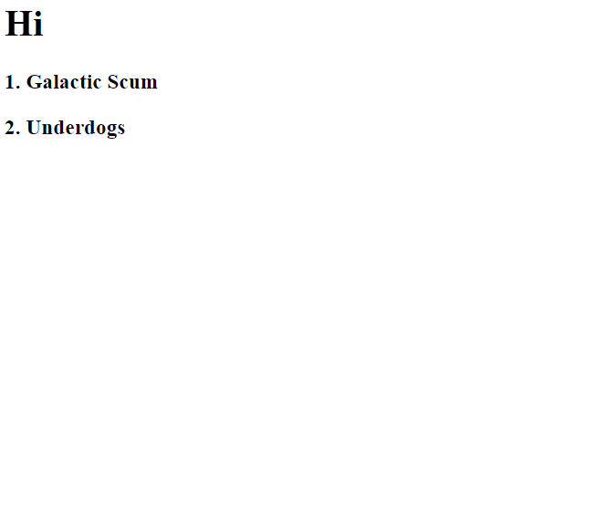

# Javascript Functions
This project is an exploration of javascript functions.I built an animal nuggetizer. I also printed some numbers to DOM.


## Screenshots


## How to run this project
* Use npm to install http-server in your terminal:
```
npm install -g http-server
```
* Run the server
```
hs -p 9999
```
* Open chrome and navigate to :
```
localhost:9999
```
